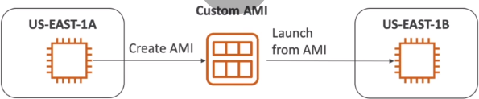

# Amazon Machine Image

1. this is user specific - customized Ec2 image
2. you can add your own software, configuration, OS, monitering
3. Our own AMI will have faster boot/configuration as software is pre-packaged
4. AMI's are built for specific region(can be copied across)
5. AN EC2 Instance can be launched from different types of AMI's
   1. till now we have used **Public AMI**: (the one crated and provided by Amazon)
   2. **Our Own AMI** : AMI created and maintained by us
   3. **AWS Marketplace for AMI** : AMI created and sold by someone else

## Hands-on

1. start ec2 instance and customize it
2. stop instance (for data integrity)
3. build an AMI from above instance- this will also create EBS snapshot
4. Launch Instance from copied AMI into another location



1. create a new Ec2 Instance with following configuration
   1. ami : aws-free ami
   2. cpu - free: t2micro
   3. instance details : Go to advanced details -> User Data keep
        ```bash
        #!/bin/bash
        yum update -y
        yum install -y httpd
        systemctl start httpd
        systemctl enable httpd
        ```
   4. storage details : select size
   5. skip tags
   6. in security groups -> Select existing Security Groups -> webaccess
   7. review then launch

2. Creating AMI From Above Ec2 Instance
   1. right click on running instance ->Images and templates -> Create Image
   2. Set name "MyFirstImage"
   3. then hit "Create Image".
3. Launch new EC2 Instance from saved AMI:
   1. Ec2 Console -> Launch Instance
   2. In Ami, Select type as "My AMI's", then choose your AMI(in our case it is named as MyFirstImage)
   3. cpu - free: t2micro
   3. instance details : Go to advanced details -> User Data keep
        ```bash
        #!/bin/bash
        echo "<h1>Hello world from $(hostname -f)</h1>" > /var/www/html/index.html
        ```
   4. storage details : select size
   5. skip tags
   6. in security groups -> Select existing Security Groups -> webaccess
   7. review then launch
   8. ### Major point to note here, is that though we dont have httpd installed from user data on ec2 instance from this step, we can still be able to run httpd server. This is becuase the AMI we used has already httpd software installed. Hence in our new instance we dont need to install httpd again. In this way, AMI's help us to boot and configure-packing software faster.
