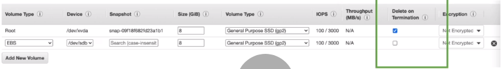
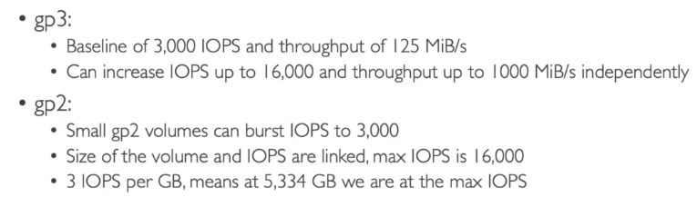
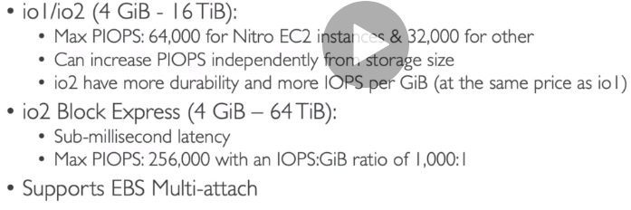
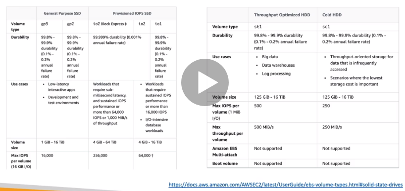
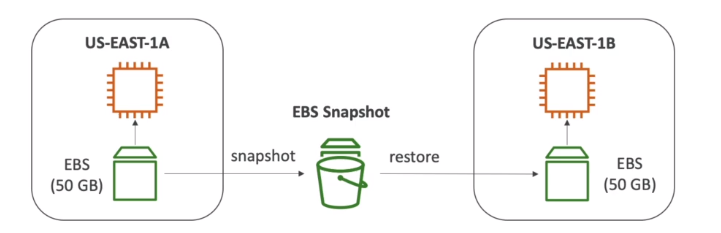
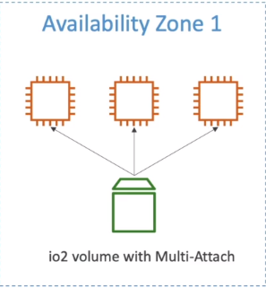
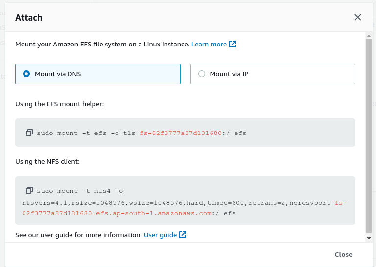
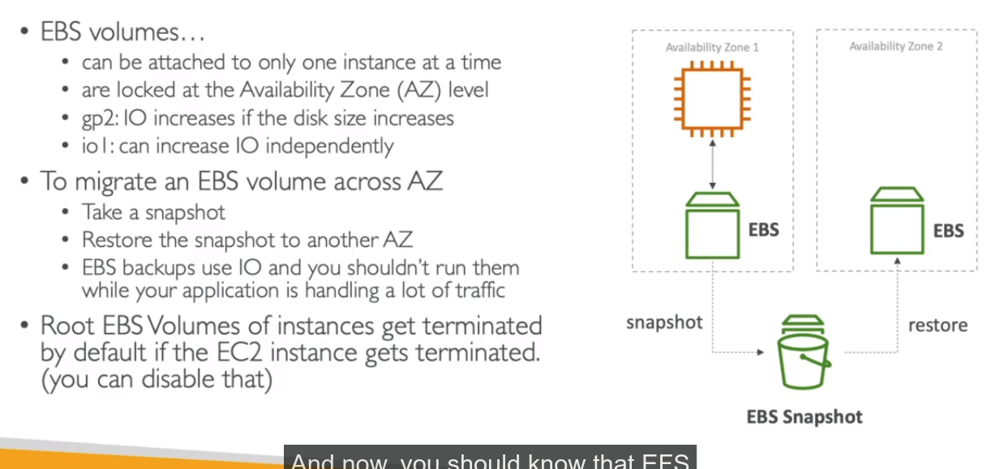
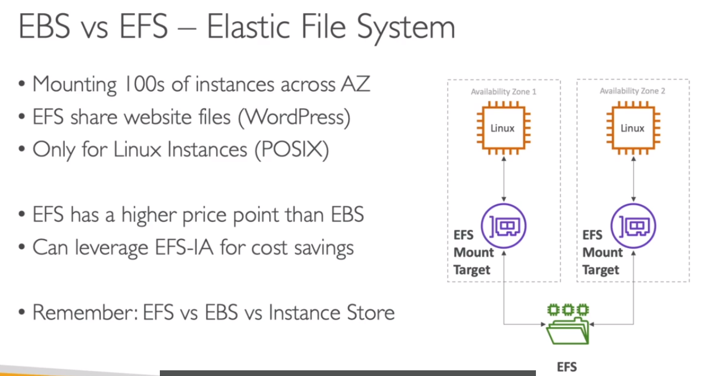

# Types are

1. EBS
   1. Volumes
   2. Snapshots
   3. AMIS
   4. Multi Attach
   5. Types
2. [EC2 Instance Store](#ec2-instance-store---io1io2)
3. [EFS](#efs)
4. [EBS vs EFS](#ebs-vs-efs)

## EBS

1. this is a virtual network drive that you can attach from one computer to another
2. Since this is on network we can see latency in data transportation
3. it is a persistant drive, means you can get your data whenever you connect back to drive
4. this is also called as **Network USB**, can be attached & detached from any ec2 instance from an availablity zone
5. this is location specific, means once you create your drive in one location, it can only be found in that location only
6. Thus to use them across any locations or availiability zone, you need to create Snapshots out of it, and then trasnport these snapshots to your required locations
7. For an EC2 Instance, we can have as many network drives connected as we want
8. for free 30 tier, we have GP2 type of SSD with 30GB storage.
9. Measured/Billed as per Size(GB), IOPS(IO-Operations-Per-Second), billed over time
10. **EXAM Topic** : **_Delete on Termination_** attribute, when we create EC2 instance from console, in ebs section we have this option, 
    1. By default,for root volume, it is selected for this attribute 
    2. By default,for non root volumes,it is not selected for this attribute. 
We can control this feature, this selection for any volume.

### Types of EBS Volums
| type | hardware type | description |
| ---  | --- | --- | 
| gp2/gp3 | SSD | <ul> <li>general purpose volumes at balaced price and performance for wide variaty of workloads</li><li>cost effective, low-latency</li><li>system boot volumes, Virtual desktops, development & test envs</li><li></li></ul> |
| io1/io2 | Highest Performance - Provisioned IOPS SSD | <ul><li>mission critical & low latency & high throughputs</li><li></li><li>256,000 is the maximum IOPS you can achieve when you're using the EBS io2 Block Express volume type.</li><li>64,000 is the maximum IOPS you can achieve when you're using EBS io1 or io2 volume types.</li></ul> |
| st1 | Low Cost - Throughput optimized HDD | <ul><li>cannot be boot volume</li><li>frequently accessed, throughput-intensive workloads</li><li>Best for **Big data**, **Data warehouses**, **log processing**</li></ul>|
| sc1 | Lowest Cost - Cold HDD| <ul><li>cannot be boot volume</li><li>less frequently accessed workloads</li></ul> |

### Exam Topic : 
1. provisioned IOPS
   1. critical business application with sustained IOPS performance
   2. application needs more than 16000 IOPS
   3. great for databases workloads (sensitive to storage performance and consistency). In such cases, switching to gp2 or gp3 to io1 or io2 is going to be answer

### Hands on
1. creating our own EBS Volumes from EC2 Console.

    1. open EC2 Console
    2. Go to Volumes on LHS
    3. click create new volume
    4. Select any type of volume(for free tier stick with gp2)
    5. keep disk size
    6. select the Volume location as same as our EC2 Instance(this is found in EC2 console, select your instance and details tab you can see location of your Ec2 instance)

2. Attaching newly created EBS to existing EC2 instances.

   1. Open EC2 Console -> Volumes
   2. click on newly created volume
   3. right click on it -> Attach Volume -> Choose Instance -> Save

3. Checking Storage Instances of an EC2 Instances

   1. open Ec2 Console -> Instances
   2. select your instance -> From details tab Go to Storage

4. format the Volumes in EC2
5. Terminate EC2 instances with EBS Connected : Root EBS will be terminated

### EBS Snapshots

1. take backups of EBS Volume at any point of time
2. you can use snapshots even after deleting the EBS volume
3. Not Necessary to detach volume to do a snapshot, but **Recommended**
4. this is also used to transport EBS from one availiability zone to another
5. the other advantage of having snapshots in other location are they acts as disasterous recovery of application

### Snapshots: Hands on:

1. creating snapshot of ebs volume
   1. Ec Console -> volumes -> choose your volume
   2. right click -> create snapshot -> Give name -> Save snapshot
2. Seeing snapshots
   1. Ec2 Console -> Snapshots -> list
3. Copying snapshot to another region
   1. Ec2 Console -> Snapshots -> choose your snapshot
   2. then hit actions -> copy
   3. in destination region - choose your region
   4. then hit copy
4. Create Volume from the snapshot
   1. Ec2 Console -> Snapshots -> choose your snapshot
   2. then hit actions -> Create Volume
   3. Choose the fields as per your requirements
   4. then hit create volume
   5. You can see new volumes in Ec2 Console -> Volumes

### EBS Multi Attach

1. EBS Volumes can be attached to only EC2 instance except EBS Multi Attach
2. In multi attach, each instance will have full read-write permissions to volume
3. this is only for specific types of work loads and specific types of EBS volumes(io1 and io2 family)
4. For this volume, you must use file system which is **clustered aware** file system 
5. Use cases :
   1. achieve higher application availiability in clustered linux applications (ex: teradata)
   2. applications must manage concurrent write operations

## [EC2 Instance Store - io1/io2](#ec2-instance-store---io1io2):

1. EBS volumes are network drives, thus limit on performance
2. EC2 Instance is physical attached disk on a server
3. for greater performance power, we choose EC2 Instance Store
4. better IO, disk performance
5. this storage will be lost when stop or terminate instance(thus not persistant: ephemeral) = Risk of data loss if hardware fails
6. good for buffer, cache, temporary content
7. backups and replication is your responsibility
Exam:Hint
Any time you see very high performance hardware attached volume for ec2 instance: choose EC2 Instance Store

## [EFS](#efs)

1. **Managed NFS(Network file system)** that can be mounted on many ec2, across many different availiability zones
2. highly expensive, highly available-scalable
3. pay for what you use
4. Use cases
   1. content management
   2. web serving
   3. data sharing
   4. wordpress
5. Uses NFSv4.1 protocal
6. Use Security groups to control access on EFS
7. compatible with linux based AMI's

### Modes of EFS - Set during EFS Creation time

1. Performance Mode:
   1. general purpose (default)- wordpress, CMS etc
   2. MaxIO Mode - high through put - used for big data, media processing
2. Through Put Mode:
   1. bursting (1TB = 50MiBs + burst upto 100MiBs)
   2. provisioned : set your throughput regardless of storage size
3. Storage Tiers (lifecycle maangement feature - move files into new tier after N days)
   1. standard : for frequently accessed files
   2. Infrequent Access (EFS-IA) : const to retrive files, lower price to store

### Hands-on : 

1. create new EFS

   1. AWS COnsole -> EFS -> Create new EFS -> Customize
   2. name : FirstEFSManual
   3. for now click "Next"
   4. Now You See Netowrk Access Settings,
      1. here we intend to create our EFS on one complete availability zone
      2. for each zone, we intend to provide security group for efs
      3. lets create a unique security group for allowing efs access
         1. EC2 Console -> 
         2. Security Group->
         3. create security group-> 
         4. name: efs-security-group -> 
         5. In inbound, add SSH and no changes in outbound rules -> 
         6. Create security group )
      4. Now in above efs security groups, cancel existing groups and select 'efs-security-group
      5. leave defaults in policy edior
      6. review and create efs

2. Staring and connecting 2 EC2 of different availiability zone

   1. create a new instance
      1. ami= amazon free tier
      2. cpu = t2.micro
      3. configure instance = goto subnet selection choose south-1b
      4. add storage
      5. skip tags
      6. in security, lets create new one with name as "EC2-to-EFS", having SSH access
      7. review and launch
      8. attach the PEM Files
   2. Create same instance of above just change subnet location south-1a
   3. now ssh into both of the instances
   4. now in each instance, install amazon utils package (`sudo yum install -y amazon-efs-utils`)
   5. Installing the NFS in both instances
      1. Go back to EFS Console
      2. open your efs
      3. click **attach**
      4. Click on **User Documentation**, from it install **_amazon utils package(sudo yum install -y amazon-efs-utils)_**
      5.  for now choose Mount via DNS, Using EFS mount helper
   6. now in both of instances :
      1. mkdir efs
      2. run command to mount efs helper module from efs console-> instance-> attach
         
      3. run cmd for `Using the EFS mount helper:`
      4. cd efs
      5. echo "sample text" > ./sample.txt
      6. now you can see the same file  in another instance present in efs folder

## [EBS vs EFS](#ebs-vs-efs)

.
EFS
