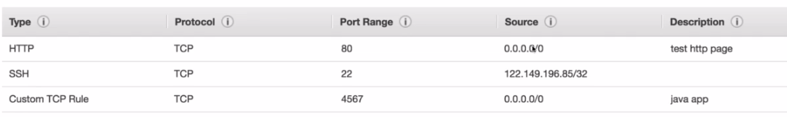

# [EC2 : Elastic Cloud Computing : Infrastrucure as a Service](https://aws.amazon.com/ec2/)

* most popular AWS Offering
* They are virtual servers in the cloud
* has capability of
  * rental Virtual machines(EC2)
  * storing data on virtual drives (EBS)
  * distributing load across machines (ELB)
  * scaling services using an auto-scaling group (ASG)
* EC2 is fundamental to understanding on how the cloud works
* Sizes & Configuration Options:
    1. AMI's : OS : windows, Linux(Centsos, ubuntu, redhat),Macos
    2. CPUS:Compute power
    3. RAM
    4. storage space
       1. Network attached (EBS & EGS)
       2. hardware attached (EC2 Instance Store)
    5. Network card access : net speed, public ip
    6. firewall rules: security group
    7. bootstrap script: (Configured on first launch): EC2 User Data
       1. boostraping means launching commands when an EC2 instance starts, thus this script only runs at startup  of an ec2 instance
       2. this majorly used for :
          1. installing updates
          2. installing software
          3. downloading any file from internet
          4. anything you need.
       3. This runs with **root user** , means any command you run will have (sudo or admin priviladges)
# Never, ever enter the access keys or security access key of an instance/user(basically anything related to IAM) in an ec2 instance, once the instance is hacked then probably the user account can also be.
---

## [EC2 Instance Types](https://aws.amazon.com/ec2/instance-types/)

* Naming Convention: **m5.2xLarge**
* Naming Convention Description

<table style="border:1px">
    <tr>
        <td> m </td>
        <td> instance class </td>
    </tr>
    <tr>
        <td> 5 </td>
        <td> generation of instance (AWS Improves them over time)</td>
    </tr>
    <tr>
        <td> 2xLarge </td>
        <td> size within an instance class </td>
    </tr>
</table>

* [Types of instances](https://instances.vantage.sh)

<table>
    <caption>Instance Types</caption>
    <tr>
        <th> Type </th>
        <th> Series </th>
        <th> Descriptions </th>
        <th> Use Cases </th>
    </tr>
    <tr>
        <td> General </td>
        <td> T </td>
        <td> great for web servers or code repos </td>
        <td>balance between compute, memory, networking </td>
    </tr>
    <tr>
        <td> Compute Optimized </td>
        <td> C </td>
        <td> great for compute intensive tasks that requires high cpu powers </td>
        <td>
            <ul>
                <li> batch processing workloads </li>
                <li> media transcoding </li>
                <li> High performance computing (HPC) </li>
                <li> Scientific modeling & machine learning </li>
                <li> dedicated gaming servers </li>
            </ul>
        </td>
    </tr>
    <tr>
        <td> Memory Optimized </td>
        <td> R, X, Z, high memory </td>
        <td> fast perfomance for workloads that process large datasets in memory </td>
        <td>
            <ul>
                <li> high performance, non-relational databases </li>
                <li> distributed web scale cache store </li>
                <li> IN MEMORY DATABASES, optimized for Business Intelligence </li>
                <li> Applications performing real-time processing of big unstructured data </li>
                <li> dedicated gaming servers </li>
            </ul>
        </td>
    </tr>
    <tr>
        <td> Storage Optimized </td>
        <td> I, D, H1 </td>
        <td> Great for storage intensive tasks that requires high, sequential read and write access to large datasets on local storage </td>
        <td>
            <ul>
                <li> high frequency online transaction processing systems </li>
                <li> relational and NoSQL Databases </li>
                <li> cache for in-memory database (ex: redis) </li>
                <li> data-ware housing applications </li>
                <li> distributed file systems </li>
            </ul>
        </td>
    </tr>
</table>

---

## [EC2 Launch Instance Types](https://aws.amazon.com/ec2/instance-types/)

1. **EC2 On Demand : Pay for what you use** - short workload, predictable prices
   1. payment : for windows & Linux you are billed for every second (after first minute of creation), others billed per hour
   2. has high cost
   3. no long term commitment : you can start, stop and terminate any instance whenever you want
   4. better for short and un-interrupted workloads where you cant predict how your app will behave
2. **Reserved** (min 1Y)
   * offer better discounts (75% off from cost off On Demand instances)
   * payment option :
     * monthly(no upfront)
     * partial upfront () discount+
     * all upfront (payment for all servers done right away) discount ++ 
   * Types : These are nothing but selecting the ec2 instance type with additional scale options
      1. Reserverd Instances - for longer workloads : fixated on a single ec2 instance : better for db apps
      2. convertible reserved instances - longer workloads with flexible instances : can change the ec2 instance : have ability scale our instance but offer less discount
      3. Schedules reserved instances - longer workloads with time specific (ex: every saturday & Sunday) : 
3. **Spot** - short workloads, cheap price, can lose instances(less reliable)
   1. offer **highest discounted** type in aws
   2. you can lose them at any point of time if your max price is less than current spot price(spot prices changes over time)
   3. Useful for
      1. batch jobs
      2. image processing
      3. data analysis
      4. distributed workloads
   4. **Never be used for** : critical jobs or databases
4. **Dedicated Host** - book an entire physical server, control instance placement
   1. here we have a physical server and ec2 instances usage are fully dedicated to us.
   2. renting an entire data center on aws for 3 YRS period reservation
   3. this can help you in

      1. ### **_Compliance Requirements_**

      2. ### **_Server Outbound Software Licenses_**

      3. complicated software licensing model(BYOL - Bring Your Own License)
      4. companies that has strong regulatory or compliance needs.
5. **Dedicated Instances**
   1. instances that running on hardware that are dedicated to you
   2. may share the hardware with other instances in same account 
   3. no control over instance placement
   4. You would like to deploy a database technology on an EC2 instance and the vendor license bills you based on the physical cores and underlying network socket visibility.

---

## **Hands-on** : EC2 with linux

* open admin console -> Services -> [EC2](https://ap-south-1.console.aws.amazon.com/ec2/v2/home)
* choose the region closet to your location from top bar
* then choose `launch an instance`
  1. Then `choose an AMI` (Amazon Machine Image) for now lets choose Amazon free tier AMI
  
  2. Choose `Instance Type` as 't2.micro'
  3. in `configure instance details`, in advanced Details section, in that in `User Data field` field paste below command

        ```sh
        #!/bin/bash
        #install httpd
        yum update -y
        yum install -y httpd
        systemctl start httpd
        systemctl enable httpd
        echo "<h1>Hello From $(hostname -f)</h1>" > /var/www/html/index.html
        ```

  4. In `Storage` section,leave defaults
  5. In `Tags` section, add tag key as `Name` and value as `My First Instance`
  6. In `Security Group` Section, choose `Create a new Security Group`
     1. add ssh , tcp, 22, custom:0.0.0.0,
     2. http, tcp, 80, custom:0.0.0.0
  7. Then hit on `review and launch` and finally `launch`
  8. Before Launching AWS will suggest you to use KEY-PAIR, which will help us to access the SSH of that EC2 instance.
     1. for that choose `Create a new Key-pair`
     2. then set key name as `EC2 Tutorial`
     3. download key value pair and then hit 'Launch Instance'
     4. for the downloaded key the set the permission to read-only: `sudo chmod 400 <file>.pem'
  9.  Accessing & Detailing the launched instances
     5. from above console, select Instances
     6. click/select on `My First Instance`, below you can find instance details bottom window.
         1. you can find key-value pair, from `Key Pair name` part of section
         2. you can find 2 IPS here: Public (Note: In corporate account, you cant see public ip) and Private.
  10. thus copy public ip and paste in another tab, you can see our server as running and displaying our message but you can see the ip of private server from that message.
  11. for now lets stop the instance. Choose Instance -> Instance Type -> Stop Instance. When you try to reload the page of application, you can see that its stuck at loading since, internet unable to find the ip of your instance.
  12. In order remove unused instances, you can make them to go into `terminate` state as launch state. Once instance is terminated, you cant re-get user or instance data.
  13. Upon `restarting` an stopped instance, you always get a new Public IP address.

---

## Ports to know

<table>
    <tr> <th> Port Number </th> <th> Used for </th> </tr>
    <tr> <th> 21 </th> <th> ftp, upload files into file share </th> </tr>
    <tr> <th> 22 </th> <th> ssh/sftp, login into ec2 instance </th> </tr>
    <tr> <th> 80 </th> <th> http, access website </th> </tr>
    <tr> <th> 443 </th> <th> https, access website </th> </tr>
    <tr> <th> 3389 </th> <th> rdp-remote desktop protocol, login into windows instance </th> </tr>
</table>

---

## Security Groups

* firewall groups / permissions around an ec2 instance, This is present around EC2 instance, but not inside of EC2
* reference via IP / Security Group
* locked down to region/VPC connection
* It is preferred to maintain one separate security group for SSH Access
* If your application gets `timeout` error, then it is a security group issue.
* If your application gets `connection refused` error, then it is a application/instance issue.
* They regulate
    1. Access to ports
    2. authorized IP ranges
    3. control of inbound and outbound network (flow of traffic from an instance to another)
* By Default
  * All inbound traffic is blocked
  * All outbound traffic is authorized
* Single group can be attached to multiple instances
* A security group can authorize multiple security groups, this is for allow data incoming,outgoing from other instance.



---

## **Hands-on** : Security groups

* open ec2 console from admin : [link](https://ap-south-1.console.aws.amazon.com/ec2/v2/home)
* choose `Security Groups` on LHS
* here you can see all available security groups,you can create your own groups here
* Connection to ec2 instance via ssh : `ssh -i <file downloaded from Hands-n Ec2, pt-8.4> ec2-user@<public ip of ec2 instance>`
* Lets try running a command : `aws iam list-users`, here you see an error saying to configure the details of user to authorize your request
* when you want to access any other aws service, you need to create a IAM Role (Never use credentials of your IAM access Keys)
* After creating a role, you can attach it to a instance via Right click on your instance -> Security -> Modify IAM Role -> Choose the role which you created/need -> save changes
* From above step the Role is attached directly(no-need for restarting the ssh session)

---

# EC2 Purchasing Options Exercise

1. On Demand = coming, staying in an hotel whenever we like, we pay the full price
2. Reserver  = planning ahead for booking + benefits with good discounts
3. Spot      = hotel allows people to bid for empty rooms and the highest bidder keeps the room. You can get kicked out at any time
4. Dedicated host = we book an entire building of resort, just to make sure that no one disturbs you
5. 