# Elastic Load Balancer

## Load balacing:

1. set of server that transfer distribute the work loads among the ec2 instances available
2. expose single point acces(DNS) to your app
3. seamlessly handle failure of downstream of instances
4. do health checks for your website. 
   1. This is very important in load balancer as each time balancer need to know whether given instance is still up and running, If not it has to divert traffic to another instance.
   2. Usally health check is done on port and a route(/heath-commonly used)
      1. if response is 200, then we can traffic to that instance
      2. else instance is unhealthy, and load balancer will mark it as unhealthy and doesnt send traffic to that instance
5. provide SSL termination for your websites
6. high availiability across zones
7. separate public traffic from private traffic
8. enforce stickiness with cookies
9.  In general, it costs less to setup a load-balancer but more effort needed to implement it properly.

## ELB

1. this is a managed load balancer, aws wil be managing it 
2. aws takes care of this tools updates, maintainance and availability
3. aws provides only few configuration knobs(to tweak the behaviour of load balancer)
4. this is integrated other aws services
   1. EC2
   2. Ec2 Auto Scaling group
   3. Amazon ECS
   4. ACM
   5. CloudWatch
   6. Route 53,
   7. WAF
   8. AWS Global Accelerator
5. Some load balancers can be set internal(private) and some as external(public) ELB's

### Security Around Load Balancer

1. users need to application/ELB from anywhere so you need to have HTTP and HTTPS allowed from anywhere.
   1. 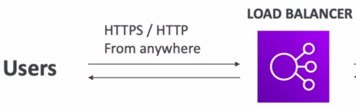
   2. Security Group   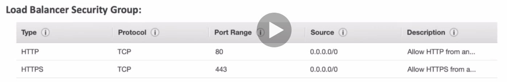
2. but the security group from load-balancer to your ec2 instance will be private, the instance can accept the traffic only coming from the load balancer.
   1. 
   2. Security Group   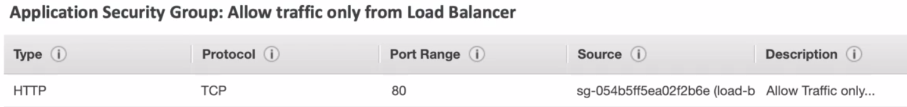
      1. In above image, you can see that it allows in http 
      2. and in source tab, you can see that security group of load balancer is attached there, this helps to allow traffic coming from load balancer to instance. So basically we likned the security group of load balancer with ec2 instance
3. finally we have. 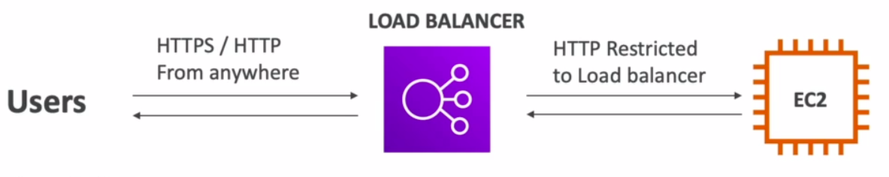

## Types

1. ### Classic load balancer( V1-old generation ) : 2009 : CLB : 

   1. even though they are old, they are 
   2. supports TCP(Layer4),HTTP & HTTPS(Layer7)
   3. health checks are TCP and HTTP based
   4. what we get out of load-balancer : fixed host name
   5. #### Hands On: 
      1. create CLB 
         1. create ec2 instances
         2. in ec2 console -> Open Load balancers in new tab -> Click Load Balancer -> Choose CLB
         3. name: first-CLB-manual
         4. protocol :Choose HTTP from anywhere
         5. select the Security group, which have access to HTTP and HTTPs
         6. in configuration, you can skip here and goto configure health checks
         7. in health checks, keep ping path as `/` healthy threashold to 5, interval to 10
         8. next add your ec2 instance, created in step 1
         9.  skip tags,
         10. review and create
         11. After your clb is up and running, you can take dns name from details tab of clb instance and verify the web page
      1.  Modifying the SG(Security Group) to allow access to port 80 that are coming from CLB only
          1.  created new security group with name "Allow Only FRom Loadbalancer"
          2.  create a rule, with type as http and ip as - choose the security group of clb (First-Loadbalancer-clb) as inbound and outbound remains default
          3.  save it
          4.  go to that ec2 instance, details-> security -> edit inbound rule,
          5.  remove custom HTTP  and select the above created security group
          6.  now you can verfiy your setting as : inbound traffic from CLB will be allowed but when you try to access your public ip of the ec2 instance, it will not show you the http output
      2.  Launching multiple instances
          1.  create multiple instances with above configurations but with different availiability zones
          2.  in the security group of instances, choose allow from load balancer SG
          3.  create 2 instances of it
          4.  now in the inbound rules add SG :Allow from clb only rule
          5.  after creation, Go to LoadBalancers in EC2 Console -> open CLB -> Choose previous created clb
          6.  select instance, right click -> edit instances -> choose the newly created EC2 instances that you just created and save it
          7.  Verfication: 
              1.  every time you refresh the dns of clb you get any one of 3 IPS(hostname),
              2.  note that none of the EC2 instances should not be public accessible, but only through CLB
          8.  Delete instances and CLB after usage.
2. ### Application Load Balancer( V2- new generation): 2016 : ALB
   1. This is based on HTTP Layer only.
   2. works on HTTP, HTTPS, Websockets
   3. means across multiple HTTP applications across different machines(target groups)
   4. means across multiple HTTP applications across same machine(containers)
   5. has latency of ~400ms
   6. routes based on
      1. url (/users & /posts)
      2. hostname in url (one.example.com & other.example.com)
      3. query string in route (/users?id=123&order=false)
      4. #### Great fit for micro-services & container based applications (Docker and Amazon ECS), has port mapping feature to dynamic port in ECS
   7. 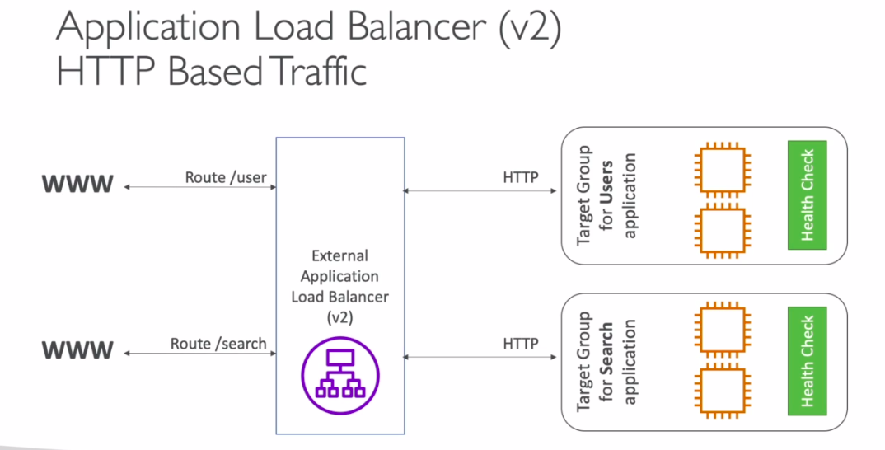 
   8. #### Application Targets Groups
      1. Ec2 Instances (can be managed by auto scaling group)-HTTP
      2. ECS Tasks(managed by ECS Itself)-HTTP
      3. Lambda functions - HTTP request is translated into JSON event (ALB will be infront of lambda functions)
      4. IP Addresses - must be private
   9. ALBS can route to different target groups
   10. health checks are at target group level
   11. example 2   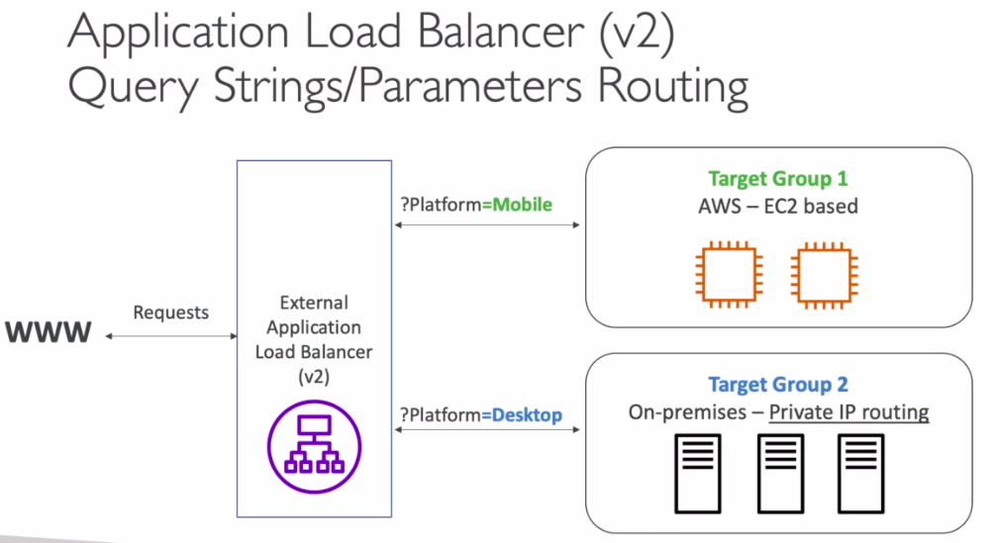
   12. #### Good To Know:
       1.  has fixed host name : XXX.region.elb.amazonaws.com
       2.  the application servers dont see the IP of client directly, the true IP of client will be inserted in header fields **_X-Forwarded-For_** and port using **_X-Forwarded-Port_** and protocol using **_X-Forwarded-Proto_**
       3. Process of communication  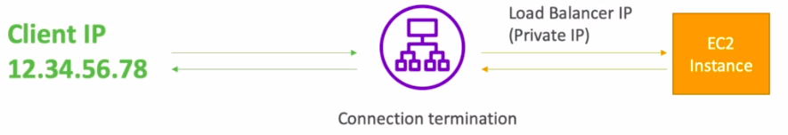  
   13. ### Hands on:
       1.  #### Creating AN ALB with one target group of 2 availiability zones as pending
           1.  EC2 Console -> Loadbalancers -> ALB -> Create
           2.  Name: First-ALB, set others to default
           3.  In security group, choose First-Load-balancer-SG
           4.  In Routing and listening, create a new target group
               1.  Hit name as "First-Target-Group"
               2.  choose type as instances
               3.  protocol: http1
               4.  healthcheck url : /
               5.  Advanced Health checking
                   1.  Healthy threshold - 2
                   2.  unhealthy threshold - 3
                   3.  Timeout - 2
                   4.  Interval - 5 and save
               6.  In registering instances, choose first 2 EC2 instances and then click "Include as pending below" and hit "Create Target Group"
               7.  Go back to the ALB, choose target group with name as "First-Target-Group"
               8.  and create ALB, once it changes status to "Provisioned/active" you can test your application
               9.  open the DNS link of the ALB, refresh multiple time, you can see that IP of app will be hopped in 2 instances
       2.  #### Demonstrate Listening of multiple targets within same ALB
           1. Creating an new target group(name: Second-Target-Group) with thrid EC2 instance
           2. Goto EC2 Console -> Load balancers -> Choose ALB created from above ->Goto Listeners tab (in details section)
           3. Click View/Edit Rules
           4. Perform as following(redirecting /test url to second target group)   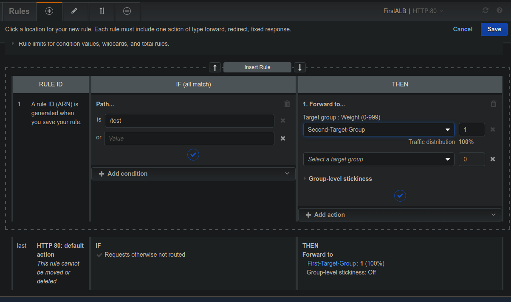
3. ### Network Load Balancer( V2 - new generation): 2017 : NLB : 
   1. works on TCP, TLS(Secure TCP), UDP. Forwards TCP and UDP to instances
   2. Has extremely high level performance, can handle millions of requests per seconds
   3. less latency ~100ms
   4. These will have **one static IP per Availiabilty zone**
   5. supports elastic IP
   6. NLB is not included in free tier
   7. Target Groups - NLB can redirect traffic/packets to
      1. EC2 Instances   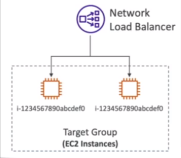
      2. IP's   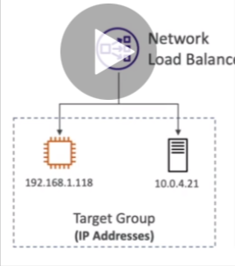
      3. ALB   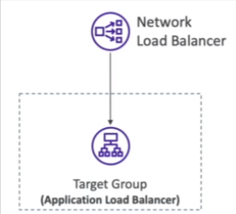
      4. 
4. ### Gateway Load Balancer : 2020 : GWLB : 
   1. works on network layer - IP Protocol(Lowest level of all above load balancers)
   2. Uses **_GENEVE_** protocol on port **_6081_**
   3. mainly used to deploy, scale, and manage a fleet of 3rd party network virtual appliance in AWS
   4. Example: Firewall, Intrusion Detection and Prevention Systems, Deep packet inspection system, payload manipulation
   5. 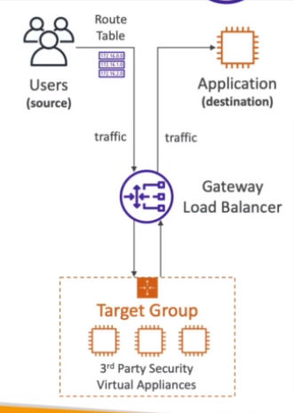
   6. Functionalities :
      1. Transparent Network Gateway: single entry and exit from load balancer
      2. Load Balancer : distribute traffic to virtual appliances
   7. Target Groups:   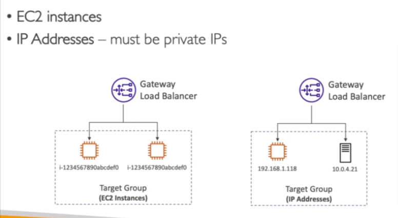

## Sticky Sessions (Session Affinity)

1. method to redirect a same client to same load balancer instance behind a load balancer
2. works/applied on CLB and ALB
3. **cookies with an expiration date** are used for stickiness
4. **_Use case_** : make sure user doesnt lose his session data
5. **_disadvantage_**: when we enable stickiness we can imbalance the load on load balancers over some instances
6. Cookie Types used in stickiness
   1. Application based cookie
      1. Generated by the application itself
      2. can include any custom data
   2. Duration based cookie