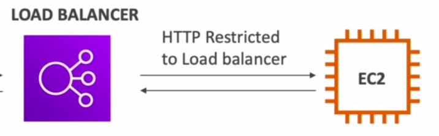

# Elastic Load Balancer

## Load balacing:

1. set of server that transfer distribute the work loads among the ec2 instances available
2. expose single point acces(DNS) to your app
3. seamlessly handle failure of downstream of instances
4. do health checks for your website. 
   1. This is very important in load balancer as each time balancer need to know whether given instance is still up and running, If not it has to divert traffic to another instance.
   2. Usally health check is done on port and a route(/heath-commonly used)
      1. if response is 200, then we can traffic to that instance
      2. else instance is unhealthy, and load balancer will mark it as unhealthy and doesnt send traffic to that instance
5. provide SSL termination for your websites
6. high availiability across zones
7. separate public traffic from private traffic
8. enforce stickiness with cookies
9.  In general, it costs less to setup a load-balancer but more effort needed to implement it properly.

## ELB

1. this is a managed load balancer, aws wil be managing it 
2. aws takes care of this tools updates, maintainance and availability
3. aws provides only few configuration knobs(to tweak the behaviour of load balancer)
4. this is integrated other aws services
   1. EC2
   2. Ec2 Auto Scaling group
   3. Amazon ECS
   4. ACM
   5. CloudWatch
   6. Route 53,
   7. WAF
   8. AWS Global Accelerator
5. Some load balancers can be set internal(private) and some as external(public) ELB's

### Security Around Load Balancer

1. users need to application/ELB from anywhere so you need to have HTTP and HTTPS allowed from anywhere.
   1. 
   2. Security Group   
2. but the security group from load-balancer to your ec2 instance will be private, the instance can accept the traffic only coming from the load balancer.
   1. 
   2. Security Group   
      1. In above image, you can see that it allows in http 
      2. and in source tab, you can see that security group of load balancer is attached there, this helps to allow traffic coming from load balancer to instance. So basically we likned the security group of load balancer with ec2 instance
3. finally we have. 

## Types

1. ### Classic load balancer( V1-old generation ) : 2009 : CLB : 

   1. even though they are old, they are 
   2. supports TCP(Layer4),HTTP & HTTPS(Layer7)
   3. health checks are TCP and HTTP based
   4. what we get out of load-balancer : fixed host name
   5. #### Hands On: 
      1. create CLB 
         1. create ec2 instances
         2. in ec2 console -> Open Load balancers in new tab -> Click Load Balancer -> Choose CLB
         3. name: first-CLB-manual
         4. protocol :Choose HTTP from anywhere
         5. select the Security group, which have access to HTTP and HTTPs
         6. in configuration, you can skip here and goto configure health checks
         7. in health checks, keep ping path as `/` healthy threashold to 5, interval to 10
         8. next add your ec2 instance, created in step 1
         9.  skip tags,
         10. review and create
         11. After your clb is up and running, you can take dns name from details tab of clb instance and verify the web page
      1.  Modifying the SG(Security Group) to allow access to port 80 that are coming from CLB only
          1.  created new security group with name "Allow Only FRom Loadbalancer"
          2.  create a rule, with type as http and ip as - choose the security group of clb (First-Loadbalancer-clb) as inbound and outbound remains default
          3.  save it
          4.  go to that ec2 instance, details-> security -> edit inbound rule,
          5.  remove custom HTTP  and select the above created security group
          6.  now you can verfiy your setting as : inbound traffic from CLB will be allowed but when you try to access your public ip of the ec2 instance, it will not show you the http output
      2.  Launching multiple instances
          1.  create multiple instances with above configurations but with different availiability zones
          2.  in the security group of instances, choose allow from load balancer SG
          3.  create 2 instances of it
          4.  now in the inbound rules add SG :Allow from clb only rule
          5.  after creation, Go to LoadBalancers in EC2 Console -> open CLB -> Choose previous created clb
          6.  select instance, right click -> edit instances -> choose the newly created EC2 instances that you just created and save it
          7.  Verfication: 
              1.  every time you refresh the dns of clb you get any one of 3 IPS(hostname),
              2.  note that none of the EC2 instances should not be public accessible, but only through CLB
          8.  Delete instances and CLB after usage.
2. ### Application Load Balancer( V2- new generation): 2016 : ALB
   1. This is based on HTTP Layer only.
   2. works on HTTP, HTTPS, Websockets
   3. means across multiple HTTP applications across different machines(target groups)
   4. means across multiple HTTP applications across same machine(containers)
   5. has latency of ~400ms
   6. routes based on
      1. url (/users & /posts)
      2. hostname in url (one.example.com & other.example.com)
      3. query string in route (/users?id=123&order=false)
      4. #### Great fit for micro-services & container based applications (Docker and Amazon ECS), has port mapping feature to dynamic port in ECS
   7.  
   8. #### Application Targets Groups
      1. Ec2 Instances (can be managed by auto scaling group)-HTTP
      2. ECS Tasks(managed by ECS Itself)-HTTP
      3. Lambda functions - HTTP request is translated into JSON event (ALB will be infront of lambda functions)
      4. IP Addresses - must be private
   9. ALBS can route to different target groups
   10. health checks are at target group level
   11. example 2   
   12. #### Good To Know:
       1.  has fixed host name : XXX.region.elb.amazonaws.com
       2.  the application servers dont see the IP of client directly, the true IP of client will be inserted in header fields **_X-Forwarded-For_** and port using **_X-Forwarded-Port_** and protocol using **_X-Forwarded-Proto_**
       3. Process of communication    
   13. ### Hands on:
       1.  #### Creating AN ALB with one target group of 2 availiability zones as pending
           1.  EC2 Console -> Loadbalancers -> ALB -> Create
           2.  Name: First-ALB, set others to default
           3.  In security group, choose First-Load-balancer-SG
           4.  In Routing and listening, create a new target group
               1.  Hit name as "First-Target-Group"
               2.  choose type as instances
               3.  protocol: http1
               4.  healthcheck url : /
               5.  Advanced Health checking
                   1.  Healthy threshold - 2
                   2.  unhealthy threshold - 3
                   3.  Timeout - 2
                   4.  Interval - 5 and save
               6.  In registering instances, choose first 2 EC2 instances and then click "Include as pending below" and hit "Create Target Group"
               7.  Go back to the ALB, choose target group with name as "First-Target-Group"
               8.  and create ALB, once it changes status to "Provisioned/active" you can test your application
               9.  open the DNS link of the ALB, refresh multiple time, you can see that IP of app will be hopped in 2 instances
       2.  #### Demonstrate Listening of multiple targets within same ALB
           1. Creating an new target group(name: Second-Target-Group) with thrid EC2 instance
           2. Goto EC2 Console -> Load balancers -> Choose ALB created from above ->Goto Listeners tab (in details section)
           3. Click View/Edit Rules
           4. Perform as following(redirecting /test url to second target group)   
3. ### Network Load Balancer( V2 - new generation): 2017 : NLB : 
   1. works on TCP, TLS(Secure TCP), UDP. Forwards TCP and UDP to instances
   2. Has extremely high level performance, can handle millions of requests per seconds
   3. less latency ~100ms
   4. These will have **one static IP per Availiabilty zone**
   5. supports elastic IP
   6. NLB is not included in free tier
   7. Target Groups - NLB can redirect traffic/packets to
      1. EC2 Instances   
      2. IP's   
      3. ALB   
      4. 
4. ### Gateway Load Balancer : 2020 : GWLB : 
   1. works on network layer - IP Protocol(Lowest level of all above load balancers)
   2. Uses **_GENEVE_** protocol on port **_6081_**
   3. mainly used to deploy, scale, and manage a fleet of 3rd party network virtual appliance in AWS
   4. Example: Firewall, Intrusion Detection and Prevention Systems, Deep packet inspection system, payload manipulation
   5. 
   6. Functionalities :
      1. Transparent Network Gateway: single entry and exit from load balancer
      2. Load Balancer : distribute traffic to virtual appliances
   7. Target Groups:   

## Sticky Sessions (Session Affinity)

1. ability to **_redirect all the request made by same client to same instance of ec2 container via load balancer_**
2. Example :    **NOTE** : In general, ALB generally distributes the requests (through an algorithm or random) to available instances
3. works/can be applied on CLB and ALB
4. **cookies with an expiration date** are used for stickiness
5. **_Use case_** : make sure user to same backend instance to all requests in order to not to lose his session data
6. **_disadvantage_**: when we enable stickiness we can imbalance the load on load balancers over some instances
7. **_Cookie Types_** used in stickiness
   1. Application based cookie
      1. Custom Cookie:
         1. Generated by the application itself
         2. can include any custom data taht we need in order to run our app
         3. You cant use names likes AWSALB, AWSALBAPP, AWSALBTG -- these are reserved for ELB
      2. Application cookie:
         1. Generated by load balancer
         2. have an expirty time - set by application
         3. cookie name is AWSALBAPP
   2. Duration based cookie
      1. cookie generated by load balancer
      2. name is AWSALB for ALB, AWSCLB for CLB
      3. Have an expiry time - set by load balancer
8. HANDS-ON : Applying sticky session on our load balancer
   1. Goto Target groups, open your group -> select it -> click actions -> edit attributes
   2. Choose Stickiness in the bottom of list  -> Choose stickyness type  -> Set duration -> save

---

## Cross Zone Load Balancing

In multiple availablity zones, we have multiple load balancers. Thus each load balancer instantly distributes evenly across all instances in all availability zones.

<table>

   <tr>
      <th>With Cross zone</th>
      <th>With-out Cross zone</th>
   </tr>
   <tr>
      <td>client makes 50 requests each for 2 AZs,but using cross-zone load balancing, all the instances all AZs receive same number of request(that is 10)</td>
      <td>In general, requests are distributed in the instances of the node of ELB</td>
   </tr>
   <tr>
      <td>This is mainly used to unload the requests that has less instances in an AZ</td>
      <td>This is the default behaviour of the load balancer</td>
   </tr>
   <tr>
      <td></td>
      <td></td>
   </tr>
</table>

### Cross Zone Behaviour Across Load Balancers

1. ALB:
   1. Always On(cant be disabled)
   2. No charge for inter AZ data transfers
2. NLB:
   1. disabled by default, but you can enable it
   2. you have to pay charge($) for inter AZ data transfers, when enabled
3. CLB:
   1. disabled by default, but you can enable it
   2. No charge($) for inter AZ data transfers, when enabled

### Hands-On: Applying cross zone load balancing in an existing load balancer
1. EC2 Console -> load balancers -> Choose an load balancer
2. In description view, scroll down till you option for " Cross Zone Load Balancing "
3. You can apply it here.

**Note**: You cant see above setting for ALB, as it is own by default

---

## SSL/TLS

### Introduction

1. SSL - Secure Socket Layer, mainly used to encrypt connections
2. TLS - Transport Layer Security, newer version of SSL-> mainly dealt with securing transport layer data
3. This is called as **in flight encryption**,encrypt data at sender -> send data to receiver -> receivers decrypts data
4. Parties Involved
   1. Certified Authorities - where you can buy ssl certificates (godaddy,comodo, globalsign, letsencrypt etc)
   2. Server Name Indication(SNI) - 
      1. solves problem of loading multiple SSL certificates onto one web server (to serve multiple websites)
      2. Here it takes host name from certificate, finds correct SSL certificate, finally redirects the request to host with in-flight encryption
5. Working of SSL in AWS Load-balancer
   1. users makes an request with ssl 
   2. connection to your public ip to public ip of load balancer is formed
   3. then load balancer sends same request to private IP of an EC2 instance
   4. Overview : 
   5. Working  :
      1. load balancer uses X.509 certificate, which is managed by **_AWS Certified Manager(ACM)_** or you can load your own ssl certificate
      2. set an HTTPS Listener, specifying certificate and additional options to support multiple domains
      3. clients use Server Name Indication(SNI) to specify host name they reach
      4. SNI redirects request to load balancers
      5. load balancers inturn check the hostname that client wants to go, get that SSL, encrypt data then pass request to correct domain
   6. Application on Load Balancers:
      1. this is only useful/works on ALB & NLB, cloudfront
      2. CLB :
         1. only SSL is supported
         2. must use multiple CLBs for multiple host names with multiple SSL certs
      3. ALB & NLB:
         1. supports multiple listeners with multiple SSL Certs
         2. Uses SNI to make it work

### Hands-On: Appling an SSL to an load balancer

For CLB:

1. EC2 Console -> load balancers -> Choose an load balancer
2. In **Listeners** View, Edit protocal
3. Choose HTTPS, then you get 
4. in cipher, choose default security policy
5. in SSL Certificate, You can paste your own SSL content here/you can choose from IAM or ACM
6. then hit save

For ALB:

1. EC2 Console -> load balancers -> Choose an load balancer
2. In **Listeners** View, Add Listener
3. change protocol to "HTTPS"
4. Default action -> "forward to" -> then select your target group
5. let security policy be default
6. let SSL Certification be default
7. hit save

For NLB:

1. EC2 Console -> load balancers -> Choose an load balancer
2. In **Listeners** View, Add Listener
3. change protocol to "TLS" 
4. Default action -> "forward to" -> then select your target group
5. let security policy be default
6. let SSL Certification be default
7. hit save

---

## Connection Draining For CLB & Deregistration Delay for ALB and NLB (exam)

1. Time to complete SSL requests, when an instance is de-registered or unhealthy
2. at that time when instance is unhealthy, load balancer stops sending the requests to that instance (called as de-registering)
3. while de-registering, an amount of time is given to users (called as draining time) to complete their existing connections and requests with unhealthy instance
4. when all requests and users are disconnected from that un healthy instance, all the connections are shut down to that ec2 instance
5. You can set the timing for draining or can be disabled by keeping value as 0.

---

## AutoScaling Groups

* In real life, the website or apps tend to have different loads across different AZs. Load can also be increased all of a sudden.
* Thus you can create and get rid of instances/servers very quickly based on the load you have
* Also when instances under ASG, when gets terminated for any reason, a new instance will be created automatically as a replacement automatically by ASG.
* **Scale-Out**: Add EC2 Instance to match increasing load
* **Scale-In**: remove EC2 Instance to match decreasing load
* we can also have limit on how many servers we want(max and min)
* Instances created here are registered into load balancer automatically
* IAM Roles attached to ASG, will be attached to EC2 instances as well
* ASG is free, Pay for underlying resources being launched.
* ASG can also termiates instances on behalf of load balancer, when an instance is marked as unhealthy (marking is done by load balancer only)

### ASG file attributes

1. launch configuration (also called as **Launch Templates"): has info about
   1. AMI + Instance Type
   2. EC2 User data
   3. EBS Volumes
   4. Security groups
   5. SSH key pairs
2. Maximum, Minimum and initial count of the instances needed
3. network + subnets information
4. load balancer (same as target group) information
5. scaling policies : rules defining when to scale in and out

### ASG Alarms

1. you can use cloudwatch alarms to trigger scaling of instances in AWS
2. the alarms are based on system resources usages ( like
   1. when cpu utilization is large
   2. number of requests on ELB instances
   3. Average network in
   4. Average network out
   5. based on schedules
   6. creating custom rules like - no.of connected users per instance (
      1. for this purpose we need to write an API to send no.of users information to cloudwatch using **_PUT METRIC API_**),
      2. then set max and min values for alarms in cloud watch
      3. then use the alarms as scaling policy for ASG
   )
3. metrics are shown as average value of all ASG Instances in cloud watch

### Hands-On:

1. create an autoscaling groups
   1. EC2 Console -> Auto Scaling Groups -> create auto scaling group
   2. name: DEMO ASG,
   3. click on "create a launch template" under launch template info
      1. specify name : MyDemoLaunchTemplate
      2. description : something
      3. In AMI, choose one
      4. instance type : t2.micro
      5. in key pair: add your key pair
      6. add any data you need in advanced details, in our case add the [script](./script.sh) we have\
   4. reload launch templates, select template with name MyDemoLaunchTemplate -> Next
   5. 